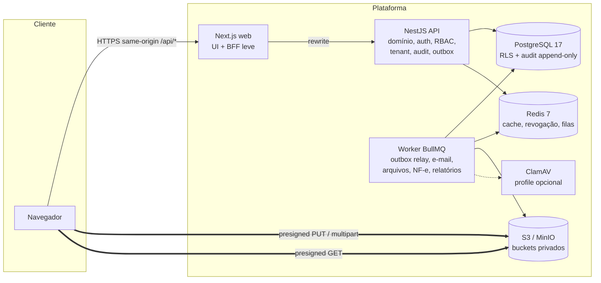

# Arquitetura da Aplicação

## Visão

Plataforma SaaS/TMS multi-tenant para o ciclo completo de uma **Ordem de Carregamento (OC)** no agronegócio: contrato → ordem → liberações → agendamentos → cargas → NF-e/documentos → recebimento → conclusão, com rastreabilidade total, faróis de visualização e colaboração entre Matriz, Fazenda e Comprador.

Estilo arquitetural: **monólito modular** (NestJS) + **worker assíncrono** (BullMQ) + **web** (Next.js). Sem microsserviços e sem Kubernetes no MVP (ver [ADR-000](decisions/ADR-000-monolito-modular.md)).

## Diagrama de contexto



Regras fundamentais:

1. **O arquivo nunca atravessa Next.js nem NestJS.** A API apenas autoriza, registra e finaliza uploads ([uploads.md](uploads.md)).
2. **O BFF do Next.js é limitado** a chamadas JSON normais via rewrite de mesma origem. SSE/WebSockets (tempo real) serão servidos por rota dedicada no reverse proxy/ingress direto para a API, sem depender do rewrite ([ADR-004](decisions/ADR-004-bff-limitado.md)).
3. **Isolamento em duas camadas**: guards de permissão na API **e** Row Level Security no PostgreSQL por tenant e organização ([multi-tenancy.md](multi-tenancy.md)).
4. **Auditoria, versão e outbox gravadas na mesma transação** da alteração de domínio ([audit-outbox.md](audit-outbox.md)).
5. **PostgreSQL é fonte de verdade** para sessões e estado; Redis é cache e mecanismo de fila ([sessions.md](sessions.md)).

## Ciclo de uma requisição autenticada

```mermaid
sequenceDiagram
  participant B as Browser
  participant W as Next (rewrite)
  participant A as API
  participant R as Redis
  participant P as Postgres (ordens_app)
  B->>W: POST /api/orders (cookie sid + X-CSRF-Token)
  W->>A: proxy
  A->>A: RequestContextMiddleware (requestId, correlationId, IP, UA)
  A->>R: sessão em cache?
  alt cache miss / security_version divergente
    A->>P: SELECT session + user.security_version
  end
  A->>A: CsrfGuard, PermissionGuard (membership ativa)
  A->>P: BEGIN; set_config(app.tenant_id, app.org_ids, app.scope...) ;<br/>domínio + versão + audit_events + outbox_events; COMMIT
  A-->>B: 201 JSON (valores decimais como string)
  Note over P: RLS aplica tenant + organização em cada linha
```

## Unidade transacional curta

Nenhuma transação fica aberta durante a vida inteira da requisição. O contexto de segurança da requisição vive em `AsyncLocalStorage`; cada operação de banco é encapsulada em `db.run(ctx, tx => ...)` que abre uma transação curta, executa `set_config(..., true)` (escopo `LOCAL`) e as queries, e devolve a conexão ao pool ([ADR-002](decisions/ADR-002-rls-tenant-organizacao.md)).

## Componentes

| Componente | Tecnologia | Responsabilidade |
|---|---|---|
| `apps/web` | Next.js 16, React 19, Tailwind 4, Radix/shadcn, Motion, TanStack Query/Table, RHF + Zod | Experiência web, design system aplicado, BFF leve |
| `apps/api` | NestJS 12 (ESM), Prisma 7, Zod, Pino | Regras de negócio, autenticação, RBAC, auditoria, outbox, presigned URLs |
| `apps/worker` | Node 24, BullMQ | Relay de outbox, e-mail, processamento de arquivos, NF-e, exportações |
| `packages/contracts` | Zod | Schemas, enums de status, catálogo de permissões, tipos compartilhados |
| `packages/db` | Prisma 7 + SQL | Schema, migrations, RLS, triggers, `db.run`, UnitOfWork, seed |
| `packages/ui` | React + Tailwind | Tokens e componentes do design system |
| `packages/config` | TS/ESLint/Prettier | Configurações compartilhadas |

## Evolução prevista (sem reescrita)

- Módulos NestJS têm fronteiras explícitas (sem acesso cruzado a tabelas de outro módulo fora de serviços públicos) → extração futura possível.
- Outbox permite webhooks, e-mail, WhatsApp e integrações sem acoplar ao request.
- `StorageService` abstrai S3 (AWS, MinIO, R2...).
- Observabilidade: logs estruturados com `requestId`/`correlationId` hoje; OpenTelemetry/Sentry/Prometheus plugáveis.
