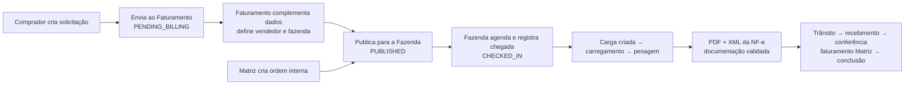
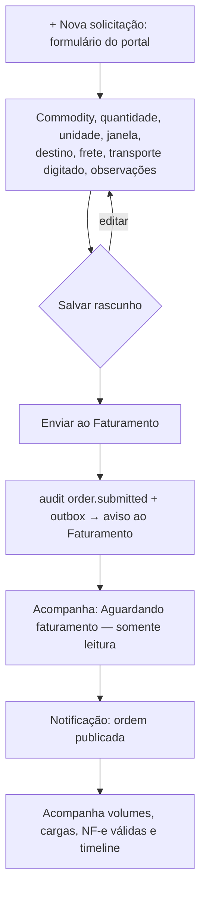
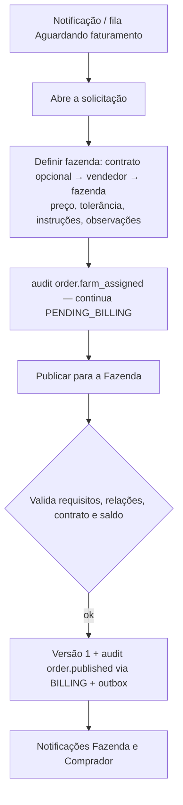
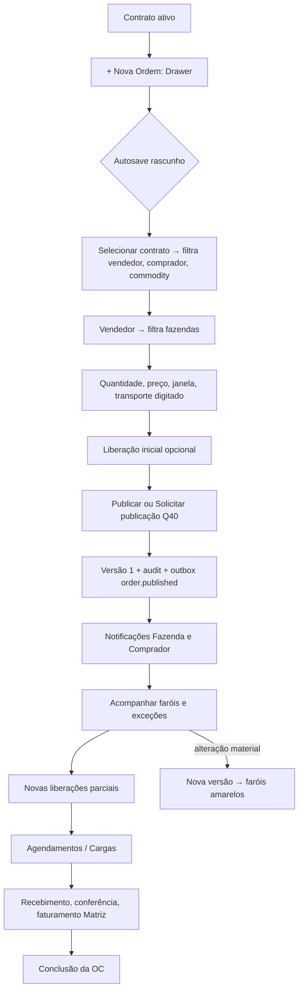
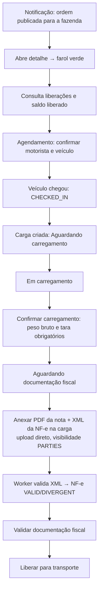
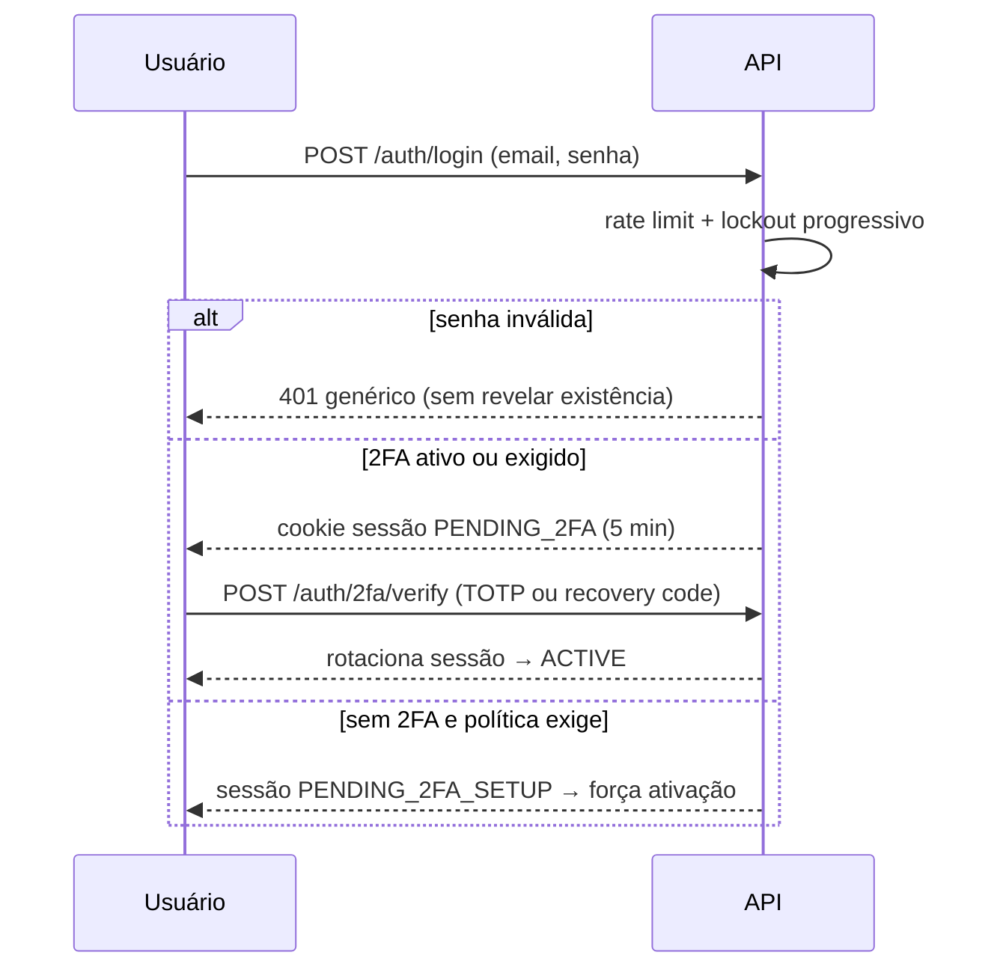

# Fluxos Operacionais

## Visão geral (Q41)

## Comprador

- O comprador da ordem é **derivado da organização ativa** (`organizations.partner_id`); o payload do portal é estrito e recusa vendedor, fazenda, contrato, preço e campos internos.
- Rascunho é visível e editável **só por quem criou**; após o envio, o Comprador apenas acompanha.
- O transporte (transportadora, motorista e veículos) é digitado pelo próprio Comprador e é **opcional** no envio; exigidos para enviar: commodity, quantidade, unidade e janela. O agendamento de cada carga nasce com esse transporte e pode corrigi-lo na portaria.
- **Devolvida pelo Faturamento**: volta a rascunho com o motivo em destaque (notificação a quem criou); o Comprador ajusta e reenvia.
- **Cancelar solicitação** (motivo obrigatório): no rascunho ou depois de enviada, **enquanto a fazenda não foi definida**; depois disso, só a Matriz. `POST /orders/:id/buyer-cancel`.
- Endpoints próprios: `POST /orders/buyer`, `PATCH /orders/buyer/:id`, `POST /orders/:id/submit` (permissão `order.submit`).

## Faturamento da Matriz

- Permissão `order.billing.manage` (papel **Faturamento**, Gestor e Administrador): `POST /orders/:id/billing/assign`, `POST /orders/:id/billing/publish` e `POST /orders/:id/billing/return` (devolver ao Comprador com motivo; descarta a análise).
- Publicação pelo Faturamento não passa pela dupla checagem da Q40.
- Correções adicionais usam o formulário interno (`order.update`); o comprador de uma solicitação do portal não pode ser trocado.
- A Matriz mantém suspensão, cancelamento, liberações, correções e auditoria.

## Matriz (ordem interna)

## Fazenda

- A Fazenda **não enxerga** ordens em rascunho, aguardando faturamento ou sem fazenda definida (RLS).
- "Validar documentação fiscal" e "Liberar para transporte" exigem pesagem, PDF disponível e o XML mais recente processado com NF-e válida ou com divergência; qualquer arquivo em envio/processamento, rejeitado ou infectado bloqueia (`FISCAL_DOCUMENTS_REQUIRED`).
- A Fazenda **não cria nem altera** ordens.

## Autenticação

