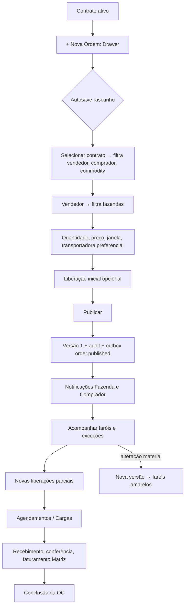
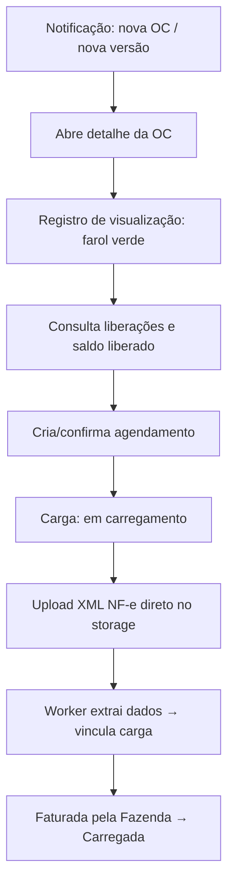
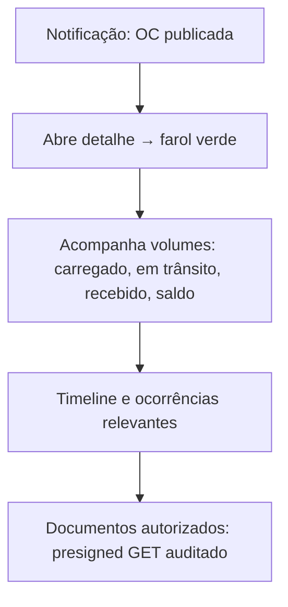
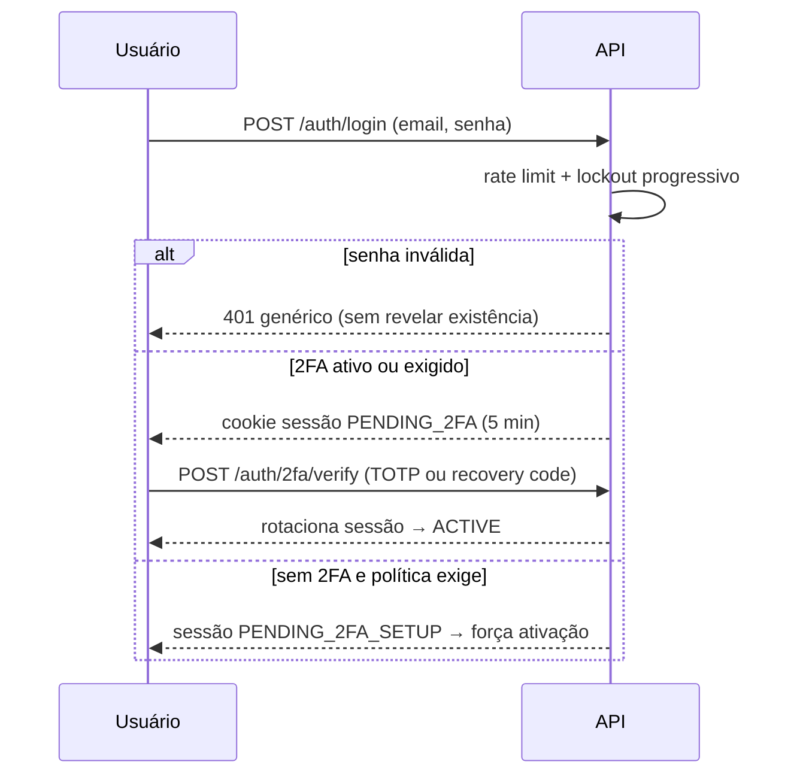

# Fluxos Operacionais

## Matriz

Pontos de decisão:

- Publicar exige validações de consistência (fazenda pertence ao vendedor; contrato compatível com vendedor/comprador/commodity; saldo contratual suficiente — **regra de bloqueio vs. alerta em aberto**, ver [open-questions.md](decisions/open-questions.md)).
- Alteração material após publicação gera nova versão e exige nova visualização.

## Fazenda

A Fazenda **não cria nem altera** OCs.

## Comprador (read-only)

## Autenticação

