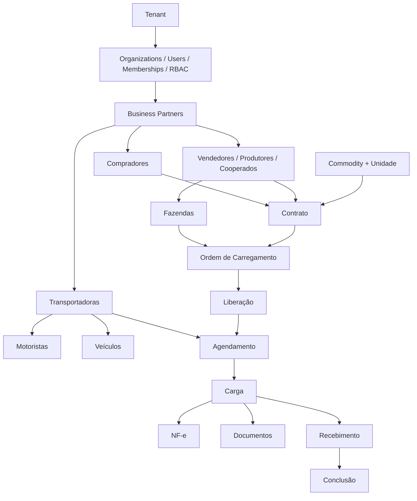

# Mapa de Módulos

## Ordem de dependência

A ordem evita o problema da aplicação anterior, em que praticamente tudo era um campo solto do formulário da OC.

## Módulos da API (`apps/api/src/modules`)

| Módulo | Fase | Responsabilidade | Principais tabelas |
|---|---|---|---|
| `health` | 1 | live/ready (Postgres, Redis, S3) | — |
| `auth` | 1 | login, sessões, senha, lockout, CSRF | users, sessions, login_attempts, password_reset_tokens |
| `two-factor` | 1 | TOTP, QR, recovery codes, política; passkeys (WebAuthn) para login sem senha | two_factor_credentials, recovery_codes, webauthn_credentials |
| `uploads` | 1 | presigned/multipart, finalização, download | file_uploads |
| `tenants` | 2 | superadmin: tenants, política de segurança | tenants |
| `organizations` | 2 | Grupos de acesso: criar/renomear/desativar por parceiro (Matriz, Fazenda/Vendedor, Comprador, Transportadora) | organizations |
| `users` | 2 | convite, memberships, papéis | users, memberships, membership_roles |
| `rbac` | 2 | catálogo de papéis/permissões | roles, permissions, role_permissions |
| `audit` | 2 | consulta de auditoria | audit_events |
| `preferences` | 2 | tema, sidebar, views salvas | user_preferences, saved_views |
| `partners` | 3 | parceiros e papéis | business_partners, partner_roles, partner_contacts, partner_addresses |
| `farms` | 3 | propriedades rurais | farms |
| `carriers` | 3 | transportadoras, motoristas, veículos | carrier_profiles, drivers, vehicles |
| `commodities` | 3 | produtos e unidades | commodities, units |
| `contracts` | 4 | contratos e saldos | contracts |
| `orders` | 5–6 | OC, versões, liberações, visualizações | loading_orders, loading_order_versions, loading_order_releases, loading_order_views |
| `appointments` | 7 | agendamentos, calendário | appointments |
| `loads` | 7 | cargas e workflow | loads, load_status_history |
| `occurrences` | 7 | ocorrências | occurrences |
| `documents` | 8 | central de documentos | documents |
| `invoices` | 8 | NF-e | invoices, invoice_items |
| `notifications` | 8 | in-app, SSE | notifications |
| `dashboards` | 9 | Matriz, Fazenda, Comprador, exceções | views/materializações |
| `reports` | 9 | relatórios e exportações assíncronas | report_jobs |

## Filas do worker

| Fila | Origem | Idempotência |
|---|---|---|
| `outbox-relay` | poller de `outbox_events` | `event_id` |
| `email` | eventos `auth.*`, `order.published` | `event_id` + template |
| `file-processing` | `upload.completed` | `file_upload_id` + estado |
| `upload-maintenance` | agendado | aborta multipart órfão |
| `nfe-parse` | `upload.available` com tipo NFE_XML | `file_upload_id` |
| `notifications` | eventos de domínio | `event_id` + destinatário |
| `report-exports` | `report.requested` (relatório em segundo plano, gerado com o RLS de quem pediu; expira em 7 dias) | `report_job_id` + estado |
| `xml-archive` | `invoice.processed`, `xml_archive.retry_requested`, `xml_archive.test_requested` e varredura a cada 15 min (cópia do XML da Fazenda na pasta de rede; smbclient em Linux, sistema de arquivos no Windows) | `invoice_id` + `archived_at` |

## Pacotes compartilhados

- `@ordens/contracts`: Zod schemas de request/response, enums (`OrderStatus`, `LoadStatus`...), `PERMISSIONS`, `ROLE_PERMISSIONS`, helpers de decimal-string.
- `@ordens/db`: Prisma client gerado, `createDb()`, `db.run()`, `db.system()`, `UnitOfWork`, seed.
- `@ordens/ui`: tokens CSS, componentes.
- `@ordens/config`: tsconfig base, ESLint flat config, Prettier.
