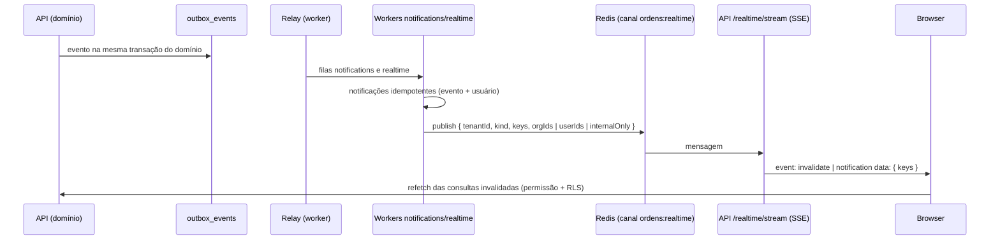

# Notificações e Tempo Real

## Fluxo

## Princípios

- **Sem dados no stream.** A mensagem só leva chaves de consulta (`['orders']`, `['logistics']`, `['fiscal']`, `['notifications']`...). A interface busca de novo pela API, onde valem permissão e RLS.
- **Entrega** (`isRealtimeDeliverable` em `@ordens/contracts`, com testes): nunca atravessa tenant; mensagem pessoal só aos `userIds`; a Matriz recebe todas as invalidações do tenant; Fazenda/Comprador só quando a organização está em `orgIds`; `internalOnly` (ex.: ocorrência interna) não chega às partes externas.
- **Organizações por evento** (worker `realtime`): ordem → vendedor/comprador (exceto rascunho); carga/agendamento → organizações da ordem; NF-e → Fazenda, e Comprador só se válida/divergente; ocorrência e documento → conforme a visibilidade.
- **Sessão:** o stream passa pelos mesmos guards (cookie de sessão). Conexões são recicladas a cada 10 min para revalidar sessão, `security_version` e membership; heartbeat a cada 25 s. Sem stream, as consultas seguem com polling (notificações a cada 60 s).
- **Rota:** em dev/compose o Next reescreve `/realtime/*` para a API. Em produção o ingress deve rotear `/realtime/*` direto para a API, sem buffering (ADR-004).

## Notificações in-app

`GET /notifications` (últimas + contador de não lidas), `POST /notifications/:id/read`, `POST /notifications/read-all`. RLS `notifications_owner` restringe ao próprio usuário. Destinatários por evento: Q25 em [decisions/open-questions.md](decisions/open-questions.md).
