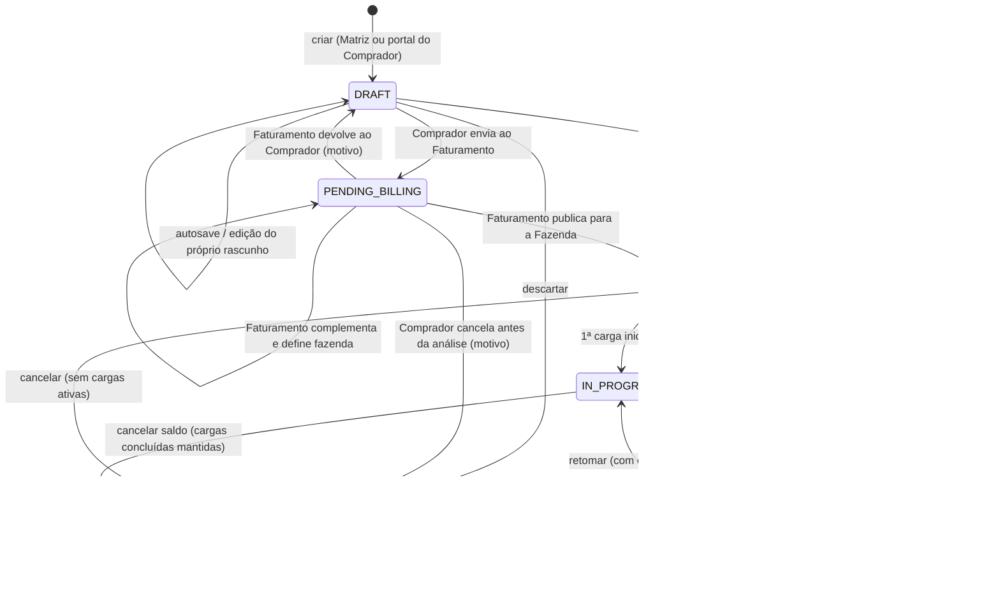
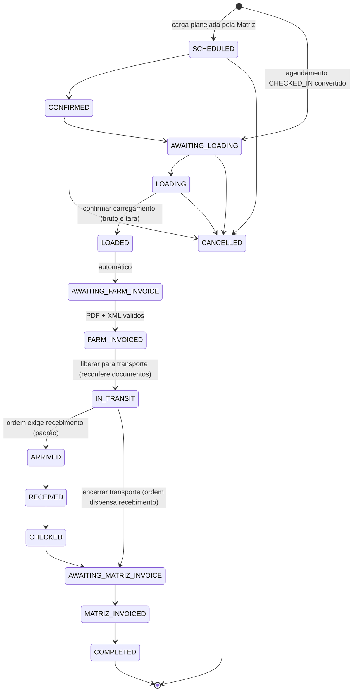
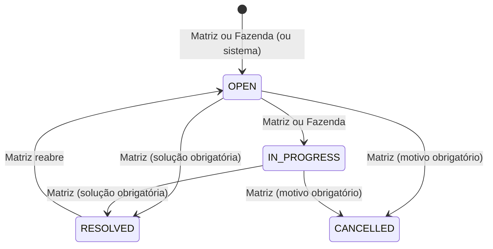

# Máquinas de Estado

Status nunca são strings livres: `enum` no PostgreSQL + `const` em `@ordens/contracts` + tabela de transições explícita validada no domínio. Toda transição grava `status_history`/`audit_events` e `outbox_events` na mesma transação.

## Ordem de Carregamento

| De | Para | Permissão | Pré-condições |
|---|---|---|---|
| — | DRAFT (`origin = MATRIZ`) | `order.create` | escopo MATRIZ |
| — | DRAFT (`origin = BUYER`) | `order.submit` | escopo BUYER; comprador derivado da organização; sem vendedor/fazenda/contrato/campos internos (API + RLS + trigger `loading_orders_buyer_guard`) |
| DRAFT | PENDING_BILLING | `order.submit` | rascunho do próprio usuário; commodity, quantidade, unidade e janela preenchidas; grava `submitted_at/by` |
| PENDING_BILLING | PENDING_BILLING | `order.billing.manage` (ou `order.update`) | define vendedor/fazenda/contrato e dados internos; comprador não muda |
| PENDING_BILLING | PUBLISHED | `order.billing.manage` | vendedor, fazenda e demais requisitos de publicação; relações e saldo do contrato; sem dupla checagem (Q40 não se aplica: pedido do Comprador + análise do Faturamento) |
| PENDING_BILLING | DRAFT | `order.billing.manage` | motivo obrigatório; limpa envio e descarta a análise (vendedor, fazenda, contrato, preço e campos internos); grava `returned_at/by/return_reason`; aviso a quem criou |
| DRAFT/PENDING_BILLING (`origin = BUYER`) | CANCELLED | `order.submit` | solicitação do próprio usuário; em `PENDING_BILLING` só antes da análise (sem vendedor/fazenda); motivo obrigatório (`cancelled_at/by/cancel_reason`); aviso ao Faturamento se já enviada |
| DRAFT (`origin = MATRIZ`) | PUBLISHED | `order.publish` | comprador, vendedor, fazenda, commodity, quantidade > 0, unidade, janela; contrato consistente; dupla checagem (Q40) |
| PUBLISHED/IN_PROGRESS | SUSPENDED | `order.cancel` | motivo obrigatório (`suspended_at/by/suspend_reason`); bloqueia liberações, agendamentos e cargas novas; cargas em andamento seguem; Fazenda e Comprador avisados com o motivo — `POST /orders/:id/suspend` |
| SUSPENDED | PUBLISHED / IN_PROGRESS | `order.cancel` | retomada: `IN_PROGRESS` se houver carga não cancelada, senão `PUBLISHED`; partes avisadas — `POST /orders/:id/resume` |
| DRAFT (interna) / PENDING_BILLING / PUBLISHED / IN_PROGRESS / SUSPENDED | CANCELLED | `order.cancel` | motivo obrigatório; recusado com carga ativa (nem concluída nem cancelada); agendamentos e liberações ativos cancelados junto; `cancelled_qty` = quantidade − carregado; cargas concluídas mantidas; avisa as partes (publicada) ou quem criou a solicitação — `POST /orders/:id/cancel` |
| IN_PROGRESS | COMPLETED | sistema/`order.cancel` | sem carga ativa nem agendamento aberto; automática exige documentação fiscal completa e quantidade dentro da tolerância; manual exige aceite da documentação pendente e motivo quando sobra saldo (Q45) |
| PUBLISHED | COMPLETED | `order.cancel` | conclusão informada pela Matriz, sem carga ativa (Q45) |

Visibilidade externa: a **Fazenda** só enxerga a partir de `PUBLISHED` e com `farm_id` definido; o **Comprador** enxerga as ordens da própria organização a partir de `PENDING_BILLING` e os próprios rascunhos do portal. Publicação gera versão 1 (ver [versioning.md](versioning.md)).

## Liberação

`ACTIVE → CONSUMED | EXPIRED | CANCELLED`. Soma de liberações ativas + consumidas ≤ quantidade da OC × (1 + tolerância), salvo regra explícita.

## Agendamento

`REQUESTED → CONFIRMED → CHECKED_IN (veículo chegou na fazenda) → CONVERTED (carga criada)`; `REQUESTED|CONFIRMED → CANCELLED | NO_SHOW`. Carga a partir de agendamento **exige `CHECKED_IN`** e nasce em `AWAITING_LOADING`.

## Carga

| Status | Rótulo PT-BR | Quem move para cá | Efeito em quantidades da OC |
|---|---|---|---|
| SCHEDULED | Agendada | MATRIZ, FARM | +scheduled |
| CONFIRMED | Confirmada | MATRIZ, FARM | — |
| AWAITING_LOADING | Aguardando carregamento | MATRIZ, FARM | — |
| LOADING | Em carregamento | FARM, MATRIZ | — (motorista e cavalo obrigatórios) |
| LOADED | Carregada | FARM, MATRIZ (peso bruto e tara obrigatórios; saldo liberado validado) | −scheduled, +loaded (peso líquido) |
| AWAITING_FARM_INVOICE | Aguardando documentação fiscal | automático após LOADED | — |
| FARM_INVOICED | Documentação fiscal validada | FARM, MATRIZ (checklist fiscal) | — |
| IN_TRANSIT | Em trânsito | MATRIZ, FARM (checklist fiscal reconferido) | +in_transit |
| ARRIVED | Chegada ao destino (só se a ordem exige recebimento) | MATRIZ | — |
| RECEIVED | Recebida | MATRIZ | −in_transit, +received |
| CHECKED | Conferida | MATRIZ | divergência gera ocorrência |
| AWAITING_MATRIZ_INVOICE | Aguardando faturamento da Matriz | MATRIZ | — |
| MATRIZ_INVOICED | Faturada pela Matriz | MATRIZ | — |
| COMPLETED | Concluída | MATRIZ | — |
| CANCELLED | Cancelada | MATRIZ (FARM antes de LOADING) | estorna scheduled; +cancelled |

### Checklist fiscal (Q41)

Regra única `evaluateFiscalDocuments` (`@ordens/contracts`), usada pela API e pela tela da carga. Para `FARM_INVOICED` e `IN_TRANSIT` (erro `FISCAL_DOCUMENTS_REQUIRED`):

1. peso bruto e tara informados;
2. PDF da nota (`file_uploads.kind = PDF`) vinculado à carga, disponível;
3. XML da NF-e (`kind = NFE_XML`) vinculado à mesma carga, disponível, processado pelo worker e com NF-e `VALID` ou `DIVERGENT`;
4. nenhum PDF/XML da carga em envio ou processamento; o arquivo **mais recente** de cada tipo não pode estar rejeitado, infectado ou com NF-e rejeitada/cancelada (um novo envio válido supera o anterior).

PDF e XML da carga ficam com visibilidade `PARTIES`. Anexos entram na timeline da ordem (`order.load_document_attached`); a validação gera `load.documents_validated` e `order.load_documents_validated`.

### Migração de cargas existentes (20260920001800)

A ordem antiga era `LOADING → AWAITING_FARM_INVOICE → FARM_INVOICED → LOADED`. Na migração: `AWAITING_FARM_INVOICE`/`FARM_INVOICED` **sem pesagem** voltam para `LOADING`; `LOADED` com NF-e ativa passa a `FARM_INVOICED`, sem NF-e ativa passa a `AWAITING_FARM_INVOICE`. Cada ajuste grava histórico e os totais das ordens são recalculados.

## NF-e

`VALID | DIVERGENT` são ativas (contam para a documentação; uma chave ativa por tenant). `REJECTED` (XML inválido, não é NF-e, chave inválida, protocolo divergente, não autorizada, chave duplicada) e `CANCELLED` (cancelamento lógico com motivo) não contam. Fazenda cancela a própria nota até `AWAITING_FARM_INVOICE`; depois disso, só a Matriz. Nenhuma nota é apagada.

## Ocorrência

Numeração `OCR-AAAA-NNNN` por tenant. Visibilidade por ocorrência (`INTERNAL`, `FARM`, `BUYER`, `PARTIES`); Fazenda só grava ocorrências visíveis a ela e não encerra (Q14, trigger `occurrences_farm_guard`).

Em `CHECKED`, recebido (convertido para kg) fora da tolerância do peso líquido abre ocorrência automática "Divergência de peso", visível à Fazenda (Q17).

Guardas: carregamento que ultrapasse `released_qty × (1 + tolerance_pct)` é bloqueado com erro de domínio `QUANTITY_EXCEEDS_RELEASED` (sem regra silenciosa). O workflow é configurável no futuro por tabela de transições por tenant; no MVP a tabela é código versionado.
