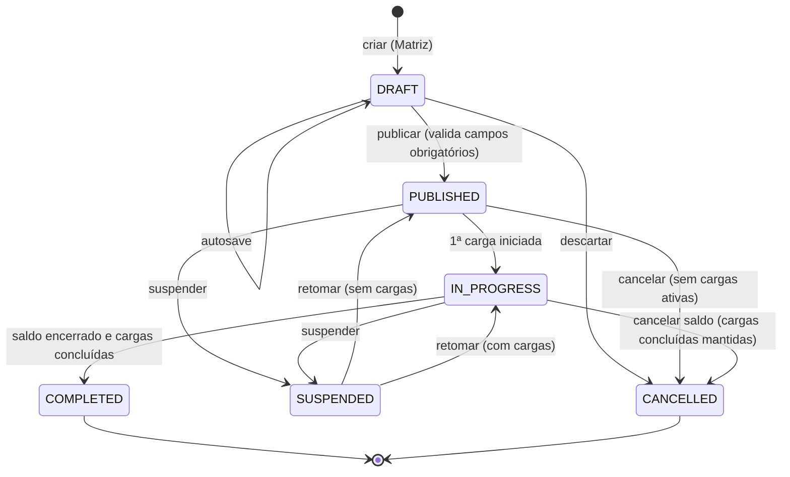
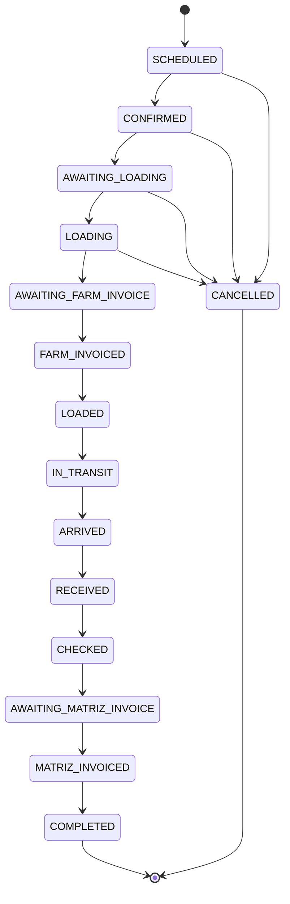

# Máquinas de Estado

Status nunca são strings livres: `enum` no PostgreSQL + `const` em `@ordens/contracts` + tabela de transições explícita validada no domínio. Toda transição grava `status_history`/`audit_events` e `outbox_events` na mesma transação.

## Ordem de Carregamento

| De | Para | Permissão | Pré-condições |
|---|---|---|---|
| — | DRAFT | `order.create` | escopo MATRIZ |
| DRAFT | PUBLISHED | `order.publish` | comprador, vendedor, fazenda, commodity, quantidade > 0, unidade, janela de carregamento; combinações consistentes com contrato |
| PUBLISHED/IN_PROGRESS | SUSPENDED | `order.cancel` | motivo obrigatório |
| PUBLISHED | CANCELLED | `order.cancel` | nenhuma carga ativa; motivo |
| IN_PROGRESS | COMPLETED | sistema/`order.update` | todas as cargas `COMPLETED`/`CANCELLED` |

Visibilidade externa (Fazenda/Comprador) começa em `PUBLISHED`. Publicação gera versão 1 (ver [versioning.md](versioning.md)).

## Liberação

`ACTIVE → CONSUMED | EXPIRED | CANCELLED`. Soma de liberações ativas + consumidas ≤ quantidade da OC × (1 + tolerância), salvo regra explícita.

## Agendamento

`REQUESTED → CONFIRMED → CHECKED_IN → CONVERTED (carga criada)`; `REQUESTED|CONFIRMED → CANCELLED | NO_SHOW`.

## Carga

| Status | Rótulo PT-BR | Quem move para cá | Efeito em quantidades da OC |
|---|---|---|---|
| SCHEDULED | Agendada | MATRIZ, FARM | +scheduled |
| CONFIRMED | Confirmada | MATRIZ, FARM | — |
| AWAITING_LOADING | Aguardando carregamento | MATRIZ, FARM | — |
| LOADING | Em carregamento | FARM, MATRIZ | — |
| AWAITING_FARM_INVOICE | Aguardando faturamento | FARM, MATRIZ | — |
| FARM_INVOICED | Faturada pela Fazenda | FARM (NF-e anexada), MATRIZ | — |
| LOADED | Carregada | FARM, MATRIZ | −scheduled, +loaded (peso líquido) |
| IN_TRANSIT | Em trânsito | MATRIZ, FARM | +in_transit |
| ARRIVED | Chegada ao destino | MATRIZ | — |
| RECEIVED | Recebida | MATRIZ | −in_transit, +received |
| CHECKED | Conferida | MATRIZ | divergência gera ocorrência |
| AWAITING_MATRIZ_INVOICE | Aguardando faturamento da Matriz | MATRIZ | — |
| MATRIZ_INVOICED | Faturada pela Matriz | MATRIZ | — |
| COMPLETED | Concluída | MATRIZ | — |
| CANCELLED | Cancelada | MATRIZ (FARM antes de LOADING) | estorna scheduled; +cancelled |

Guardas: carregamento que ultrapasse `released_qty × (1 + tolerance_pct)` é bloqueado com erro de domínio `QUANTITY_EXCEEDS_RELEASED` (sem regra silenciosa). O workflow é configurável no futuro por tabela de transições por tenant; no MVP a tabela é código versionado.
