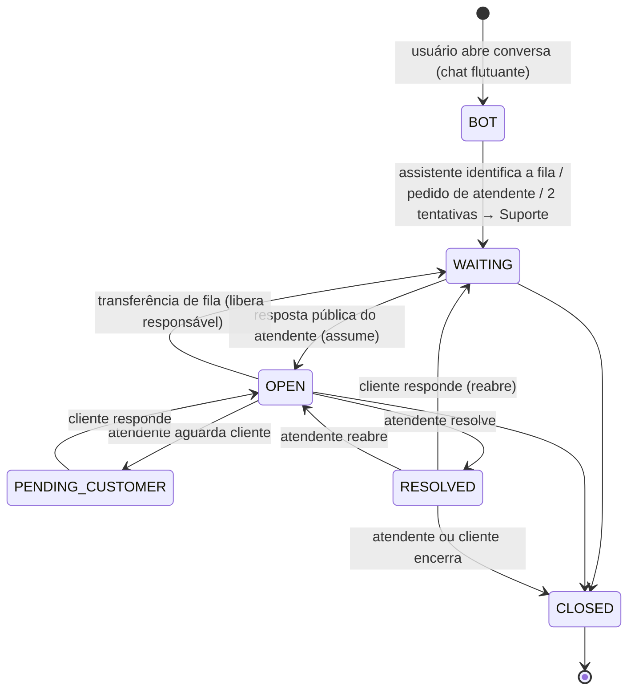

# Atendimento (chat + assistente + times + indicadores)

Funcionalidade adicionada fora do escopo original: conversa de atendimento dentro da plataforma, com assistente de triagem que direciona para **Faturamento** ou **Suporte**, painéis separados para cada time e indicadores de acompanhamento dos chamados.

## Fluxo

## Assistente

- Regras, sem IA externa (nenhum dado sai da plataforma): botões **Faturamento**, **Suporte** e **Falar com um atendente**, e classificação por palavras-chave em texto livre (`classifySupportText` em `@ordens/contracts`, com testes).
- Pede descrição curta quando a fila vem por botão; número de OC citado (`AAAA/NNNNN`) é vinculado se o usuário puder ver a ordem (consulta sob o RLS dele).
- Escolhas por botão ficam registradas como mensagem do cliente.

## Times e painéis (Q31)

| Rota | Quem acessa | Conteúdo |
|---|---|---|
| `/atendimento/faturamento` | `support.billing` (Atendente Faturamento, Operador) e supervisão | Fila, atendimento e ações só de Faturamento |
| `/atendimento/suporte` | `support.support` (Atendente Suporte, Operador) e supervisão | Fila, atendimento e ações só de Suporte |
| `/atendimento` | supervisão (`support.manage`: Gestor, Administrador) no menu; qualquer atendente pelo link de notificação | Todas as filas do usuário; supervisão vê também conversas com o assistente |
| `/atendimento/indicadores` | qualquer atendente ou supervisão | Indicadores recortados pelas filas do usuário |

`/suporte` redireciona para `/atendimento` (links de notificações antigas).

| | Abrir conversa | Faturamento | Suporte | Supervisão |
|---|---|---|---|---|
| Administrador / Gestor Matriz | ● | ● | ● | ● |
| Operador Matriz | ● | ● | ● | — |
| Atendente Faturamento | ● | ● | — | — |
| Atendente Suporte | ● | — | ● | — |
| Matriz somente leitura, Fazenda, Comprador, Transportadora | ● | — | — | — |

- A API aplica o recorte em lista, resumo, detalhe, mensagens, atribuição, status, transferência e indicadores. Conversa de outra fila responde **404**; pedir explicitamente outra fila responde **403**.
- Responsável precisa atender a fila da conversa. A transferência para a outra fila libera o responsável e tira a conversa do painel do time de origem.
- RLS: a Matriz vê todas as conversas do tenant; os demais, só as que abriram. **Notas internas** nunca são visíveis a quem abriu a conversa (política de leitura) e o cliente não consegue gravá-las. O recorte por time é regra de aplicação, sobre o RLS de tenant.
- Trigger `support_conversations_customer_guard`: quem abriu a conversa não altera responsável, prioridade, solicitante nem move status fora do fluxo do cliente.
- Mensagens são append-only (sem UPDATE/DELETE) e ordenadas por identity (`seq`); conversas nunca são apagadas. Status, atribuição e transferência vão para a auditoria na mesma transação.

## Indicadores (Q32)

Período de 7, 30 ou 90 dias (horário de Brasília), filtro por fila para quem atende mais de uma e comparação com o período anterior de mesmo tamanho.

- **KPIs**: conversas abertas, resolvidas (e taxa de resolução das encaminhadas), 1ª resposta média, tempo em que 90% foram respondidas (p90), resolução média, backlog atual e sem responsável, desistências no assistente (supervisão).
- **Gráficos**: volume diário (abertas × resolvidas), backlog por status e por prioridade, distribuição do tempo até a 1ª resposta, horário de abertura (0–23h), comparativo entre filas, perfil de quem abre (Fazendas, Compradores…) e desempenho por atendente (em andamento, resolvidas, respostas, 1ª resposta média).
- Tempos contam a partir da abertura da conversa; métricas por atendente usam o responsável atual. Sem meta de SLA (Q30).
- Consultas agregadas em SQL sob o RLS do tenant; o painel atualiza a cada minuto e na invalidação em tempo real de `['support']`.

## Tempo real e avisos

Eventos `support.*` saem pela outbox. O worker publica invalidação `['support']` para a equipe (Matriz) e para quem abriu (exceto notas internas) e cria notificações: resposta do atendente → cliente (abre o chat), mensagem do cliente → responsável (`/atendimento?conversa=`), atribuição → novo responsável, resolvida → cliente.

## API

| Método | Rota | Permissão |
|---|---|---|
| GET/POST | `/support/conversations` | `support.use` |
| GET | `/support/conversations/:id` | `support.use` (dono) ou atendente da fila |
| POST | `/support/conversations/:id/messages` | `support.use` (nota interna só atendente da fila) |
| POST | `/support/conversations/:id/close` | `support.use` (dono) |
| GET | `/support/queue`, `/support/summary?queue=`, `/support/agents?queue=`, `/support/analytics?days=&queue=` | alguma fila (`RequireAnyPermission`) |
| POST/PATCH | `/support/conversations/:id/assign`, `/transition`, `PATCH /:id` | atendente da fila da conversa |

Regras provisórias: Q26–Q32 em [decisions/open-questions.md](decisions/open-questions.md).
