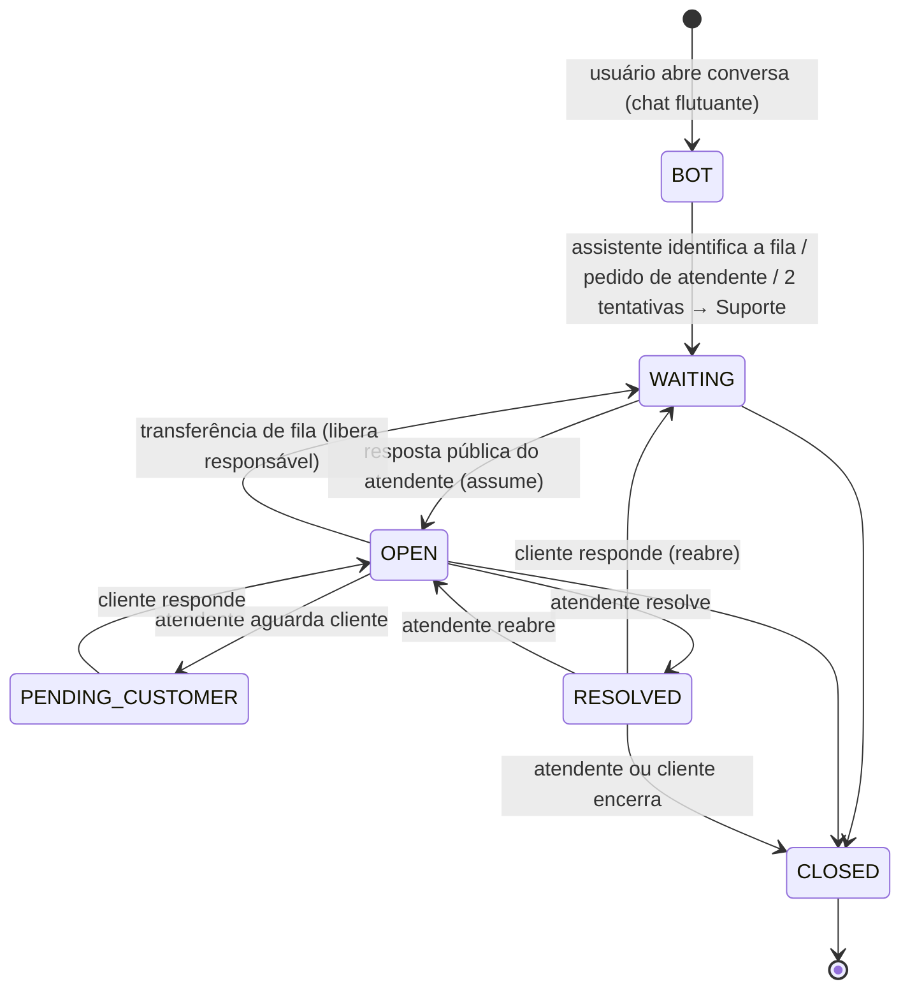

# Atendimento (chat + assistente + painel)

Funcionalidade adicionada fora do escopo original: conversa de atendimento dentro da plataforma, com assistente de triagem que direciona para **Faturamento** ou **Suporte**, e painel para a equipe controlar as demandas.

## Fluxo

## Assistente

- Regras, sem IA externa (nenhum dado sai da plataforma): botões **Faturamento**, **Suporte** e **Falar com um atendente**, e classificação por palavras-chave em texto livre (`classifySupportText` em `@ordens/contracts`, com testes).
- Pede descrição curta quando a fila vem por botão; número de OC citado (`AAAA/NNNNN`) é vinculado se o usuário puder ver a ordem (consulta sob o RLS dele).
- Escolhas por botão ficam registradas como mensagem do cliente.

## Permissões e isolamento

| | Abrir conversa | Painel / responder como equipe |
|---|---|---|
| Matriz (Admin, Gestor, Operador) | ● | ● `support.manage` |
| Matriz somente leitura | ● | — |
| Fazenda, Comprador, Transportadora | ● `support.use` | — |

- RLS: a Matriz vê todas as conversas do tenant; os demais, só as que abriram. **Notas internas** nunca são visíveis a quem abriu a conversa (política de leitura) e o cliente não consegue gravá-las.
- Trigger `support_conversations_customer_guard`: quem abriu a conversa não altera responsável, prioridade, solicitante nem move status fora do fluxo do cliente.
- Mensagens são append-only (sem UPDATE/DELETE) e ordenadas por identity (`seq`); conversas nunca são apagadas. Status, atribuição e transferência vão para a auditoria na mesma transação.

## Tempo real e avisos

Eventos `support.*` saem pela outbox. O worker publica invalidação `['support']` para a equipe (Matriz) e para quem abriu (exceto notas internas) e cria notificações: resposta do atendente → cliente (abre o chat), mensagem do cliente → responsável, atribuição → novo responsável, resolvida → cliente.

## API

| Método | Rota | Permissão |
|---|---|---|
| GET/POST | `/support/conversations` | `support.use` |
| GET | `/support/conversations/:id` | `support.use` (dono) ou `support.manage` |
| POST | `/support/conversations/:id/messages` | `support.use` (nota interna só equipe) |
| POST | `/support/conversations/:id/close` | `support.use` (dono) |
| GET | `/support/queue`, `/support/summary`, `/support/agents` | `support.manage` |
| POST/PATCH | `/support/conversations/:id/assign`, `/transition`, `PATCH /:id` | `support.manage` |

Regras provisórias: Q26–Q30 em [decisions/open-questions.md](decisions/open-questions.md).
