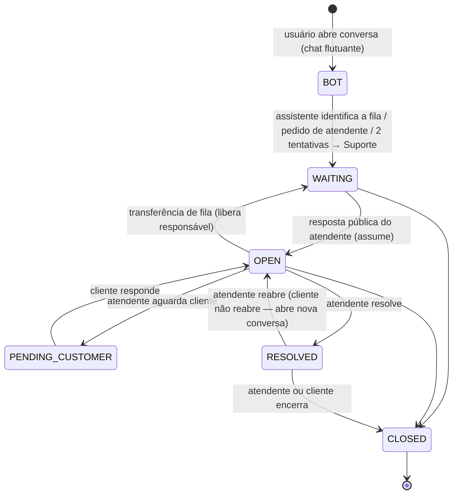

# Atendimento (chat + assistente + times + indicadores)

Funcionalidade adicionada fora do escopo original: conversa de atendimento dentro da plataforma, com assistente de triagem que direciona para **Faturamento** ou **Suporte**, painéis separados para cada time e indicadores de acompanhamento dos chamados.

## Fluxo

```mermaid
stateDiagram-v2
  [*] --> BOT: usuário abre conversa (chat flutuante)
  BOT --> WAITING: assistente identifica a fila / pedido de atendente / 2 tentativas → Suporte
  WAITING --> OPEN: resposta pública do atendente (assume)
  OPEN --> PENDING_CUSTOMER: atendente aguarda cliente
  PENDING_CUSTOMER --> OPEN: cliente responde
  OPEN --> WAITING: transferência de fila (libera responsável)
  OPEN --> RESOLVED: atendente resolve
  RESOLVED --> OPEN: atendente reabre (cliente não reabre — abre nova conversa)
  WAITING --> CLOSED
  OPEN --> CLOSED
  RESOLVED --> CLOSED: atendente ou cliente encerra
  CLOSED --> [*]
```

## Assistente

- Regras, sem IA externa (nenhum dado sai da plataforma): botões **Faturamento**, **Suporte** e **Falar com um atendente**, e classificação por palavras-chave em texto livre (`classifySupportText` em `@ordens/contracts`, com testes).
- Pede descrição curta quando a fila vem por botão; número de OC citado (`AAAA/NNNNN`) é vinculado se o usuário puder ver a ordem (consulta sob o RLS dele).
- Escolhas por botão ficam registradas como mensagem do cliente.

## Times e painéis (Q31)

| Rota | Quem acessa | Conteúdo |
|---|---|---|
| Rota | Quem acessa | Conteúdo |
|---|---|---|
| `/atendimento/faturamento` | quem está na fila de Faturamento (equipe) e supervisão | Fila, atendimento e ações só de Faturamento |
| `/atendimento/suporte` | quem está na fila de Suporte (equipe) e supervisão | Fila, atendimento e ações só de Suporte |
| `/atendimento` | supervisão no menu; qualquer atendente pelo link de notificação | Todas as filas do usuário; supervisão vê também conversas com o assistente |
| `/atendimento/indicadores` | quem atende alguma fila e supervisão | Indicadores recortados pelas filas do usuário |
| `/atendimento/equipe` | supervisão (`support.manage`) | Define as filas de cada atendente |

`/suporte` redireciona para `/atendimento` (links de notificações antigas).

### Quem atende o quê

- **Papel** define quem *pode* atender: `support.attend` (Operador Matriz e Atendente). Gestor e Administrador têm `support.manage` (supervisão) e atendem todas as filas.
- **Equipe** (`support_queue_members`) define *em quais filas*: a supervisão marca Faturamento e/ou Suporte por usuário em Atendimento → Equipe. Mudanças valem na hora (o menu do atendente atualiza em tempo real) e são auditadas (`support.team_updated`).
- Ao tirar alguém de uma fila, as conversas dele naquela fila voltam para "Aguardando atendente" sem responsável.
- Somente leitura, Fazenda, Comprador e Transportadora só abrem conversas pelo chat.

- A API aplica o recorte em lista, resumo, detalhe, mensagens, atribuição, status, transferência e indicadores. Conversa de outra fila responde **404**; pedir explicitamente outra fila responde **403**.
- Responsável precisa atender a fila da conversa. A transferência para a outra fila libera o responsável e tira a conversa do painel do time de origem.
- Conversa **resolvida não reabre pelo cliente** (Q29): API e trigger do banco bloqueiam; o chat oferece "Abrir nova conversa". O atendente ainda pode reabrir.

## SLA de 1ª resposta (Q30)

- Prazo de **1 hora** (`SUPPORT_FIRST_RESPONSE_SLA_MINUTES`) contado desde a (última) entrada na fila, enquanto a conversa aguarda atendente.
- Painéis: contagem regressiva "responder em X min" (alerta a partir de 15 min), selo "SLA estourado há …" e indicador **Fora do SLA (1 h)**.
- Indicadores: % das conversas respondidas dentro do SLA no período e quantas estão fora do prazo agora.
- Cobrança: job `support-sla` do worker a cada 5 minutos avisa supervisão e atendentes da fila, **uma vez por entrada na fila** (`sla_notified_at` + `eventId` idempotente). Transferência ou nova entrada na fila reinicia o prazo.
- RLS: a Matriz vê todas as conversas do tenant; os demais, só as que abriram. **Notas internas** nunca são visíveis a quem abriu a conversa (política de leitura) e o cliente não consegue gravá-las. O recorte por time é regra de aplicação, sobre o RLS de tenant.
- Trigger `support_conversations_customer_guard`: quem abriu a conversa não altera responsável, prioridade, solicitante nem move status fora do fluxo do cliente.
- Mensagens são append-only (sem UPDATE/DELETE) e ordenadas por identity (`seq`); conversas nunca são apagadas. Status, atribuição e transferência vão para a auditoria na mesma transação.

## Indicadores (Q32)

Período de 7, 30 ou 90 dias (horário de Brasília), filtro por fila para quem atende mais de uma e comparação com o período anterior de mesmo tamanho.

- **KPIs**: conversas abertas, resolvidas (e taxa de resolução das encaminhadas), 1ª resposta média, tempo em que 90% foram respondidas (p90), resolução média, backlog atual e sem responsável, desistências no assistente (supervisão).
- **Gráficos**: volume diário (abertas × resolvidas), backlog por status e por prioridade, distribuição do tempo até a 1ª resposta, horário de abertura (0–23h), comparativo entre filas, perfil de quem abre (Fazendas, Compradores…) e desempenho por atendente (em andamento, resolvidas, respostas, 1ª resposta média).
- Tempos contam a partir da abertura da conversa; métricas por atendente usam o responsável atual. Sem meta de SLA (Q30).
- Consultas agregadas em SQL sob o RLS do tenant; o painel atualiza a cada minuto e na invalidação em tempo real de `['support']`.

## Tempo real e avisos

Eventos `support.*` saem pela outbox. O worker publica invalidação `['support']` para a equipe (Matriz) e para quem abriu (exceto notas internas) e cria notificações: resposta do atendente → cliente (abre o chat), mensagem do cliente → responsável (`/atendimento?conversa=`), atribuição → novo responsável, resolvida → cliente.

## API

| Método | Rota | Permissão |
|---|---|---|
| GET/POST | `/support/conversations` | `support.use` |
| GET | `/support/conversations/:id` | `support.use` (dono) ou atendente da fila |
| POST | `/support/conversations/:id/messages` | `support.use` (nota interna só atendente da fila) |
| POST | `/support/conversations/:id/close` | `support.use` (dono) |
| GET | `/support/queue`, `/support/summary?queue=`, `/support/agents?queue=`, `/support/analytics?days=&queue=` | alguma fila (`RequireAnyPermission`) |
| POST/PATCH | `/support/conversations/:id/assign`, `/transition`, `PATCH /:id` | atendente da fila da conversa |

Regras provisórias: Q26–Q32 em [decisions/open-questions.md](decisions/open-questions.md).

## Fila no chat do atendente

Quem atende alguma fila ganha a aba **Na fila** no próprio balão do chat, ao lado de "Minhas
conversas". Ela lista as conversas aguardando atendimento nas filas da pessoa, com **Assumir**: ao
assumir, a conversa abre ali mesmo em modo de atendente (nota interna disponível, sem respostas
rápidas do assistente), sem precisar ir até o painel.

A aba só existe para quem está em alguma equipe — para o cliente, o balão continua mostrando apenas
as próprias conversas. O contador do balão soma o que espera resposta nos dois papéis.

O painel de Atendimento continua sendo o lugar completo: filtros, indicadores, transferência entre
filas e histórico. A aba no chat é o atalho para pegar um chamado sem trocar de tela.

## Imagens e captura de tela no chat

O compositor (chat do cliente e painel do atendente) tem **Capturar tela** e **Anexar imagem**; o
Print Screen também pode ser colado direto na caixa de texto.

A captura usa `getDisplayMedia`: quem escolhe a aba, janela ou monitor é a pessoa, no diálogo do
próprio navegador — o sistema nunca captura sozinho. Lido o quadro, o compartilhamento é encerrado na
hora, inclusive se algo falhar no meio. A imagem é reduzida para 1920 px de largura e salva em WebP,
baixando a qualidade até caber em 10 MB.

**Nem todo navegador captura tela**: iOS e Android não têm `getDisplayMedia`. Nesses casos o botão
avisa e a pessoa anexa ou cola uma imagem — o fluxo continua o mesmo.

| Regra | Valor |
|---|---|
| Formatos | PNG, JPEG, WebP |
| Tamanho | 10 MB por imagem |
| Por mensagem | até 3 imagens |
| Permissão | `support.use` (não `document.upload`) |
| Remoção | `support.manage`, com motivo |
| Retenção | 90 dias, depois o objeto é apagado do storage |

### Quem enxerga

Diferente do resto do sistema, onde o documento é da organização, **a imagem do atendimento é do
usuário que abriu a conversa**: um colega da mesma empresa não vê o print de outro. A regra está na
RLS (`file_uploads_scope_read` e `support_message_attachments_read`), não só na tela.

- Quem abriu a conversa vê as imagens das mensagens públicas dela.
- O atendimento vê tudo da conversa, inclusive imagem de nota interna.
- **Nota interna com imagem não chega ao cliente**: nem na conversa, nem pelo endereço de download.
- O download passa por `GET /support/attachments/:id/download`, que confere o acesso à conversa antes
  de gerar uma URL temporária. A URL do storage nunca é exposta.

### Processamento e privacidade

A imagem usa o mesmo pipeline dos demais anexos (quarentena, checksum, tipo real por magic bytes,
antivírus, promoção). Enquanto não termina, a miniatura mostra **"Verificando captura"** e não há o
que abrir; rejeitada ou bloqueada, aparece marcada.

O compositor avisa antes do envio: *"Revise a imagem antes de enviar. Não compartilhe senhas, tokens
ou dados pessoais desnecessários."* Ainda assim, a tela inteira pode trazer o que estava aberto, por
isso a Matriz pode apagar uma imagem (`POST /support/attachments/:id/remove`, com motivo) e a varredura
do worker apaga o objeto depois de 90 dias. Os dois casos ficam na auditoria; o registro continua no
histórico, marcado como removido, para a conversa não perder o sentido.

A triagem do assistente continua exigindo texto: imagem sozinha não classifica o atendimento.
